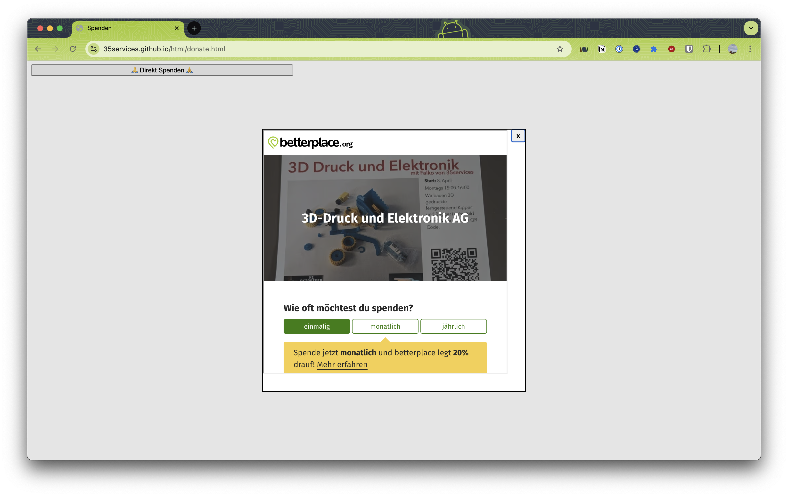

# HTML sniplets

## Donate
Using `dialog` https://developer.mozilla.org/de/docs/Web/HTML/Reference/Elements/dialog

live at https://35services.github.io/html/index.html

- [Donate Page (Direct iFrame)](donate.html) - Direct donation page with embedded iframe (may be blocked by browser security)
   - 
- [Donate Page (JavaScript Embed)](donate_with_script.html) - Direct donation page using betterplace.org's official JavaScript embed code
